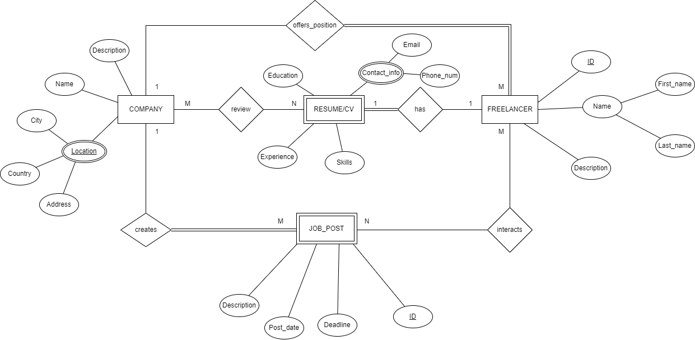
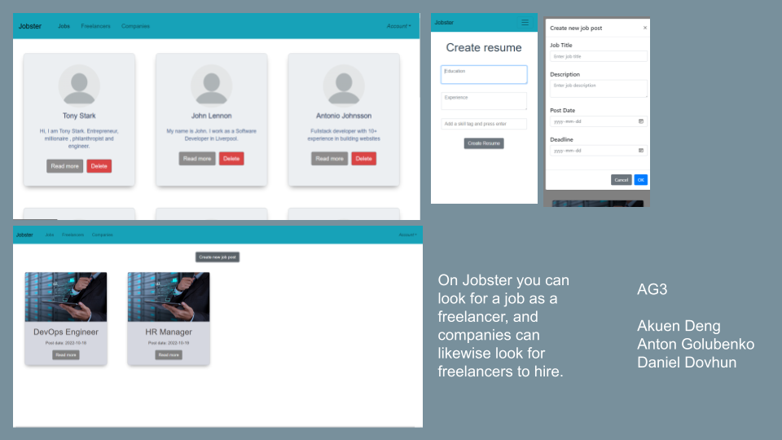

# Backend and Frontend Template

Latest version: https://git.ita.chalmers.se/courses/dit341/group-00-web (public Github [mirror](https://github.com/dit341/group-00-web))

## Project Structure

| File                                                 | Purpose                           | What you do?                              |
| ---------------------------------------------------- | --------------------------------- | ----------------------------------------- |
| `server/`                                            | Backend server code               | All your server code                      |
| [server/README.md](server/README.md)                 | Everything about the server       | **READ ME** carefully!                    |
| `client/`                                            | Frontend client code              | All your client code                      |
| [client/README.md](client/README.md)                 | Everything about the client       | **READ ME** carefully!                    |
| [docs/DEPLOYMENT.md](docs/DEPLOYMENT.md)             | Free online production deployment | Deploy your app online in production mode |
| [docs/LOCAL_DEPLOYMENT.md](docs/LOCAL_DEPLOYMENT.md) | Local production deployment       | Deploy your app local in production mode  |

## Requirements

The version numbers in brackets indicate the tested versions but feel free to use more recent versions.
You can also use alternative tools if you know how to configure them (e.g., Firefox instead of Chrome).

- [Git](https://git-scm.com/) (v2) => [installation instructions](https://www.atlassian.com/git/tutorials/install-git)
  - [Add your Git username and set your email](https://docs.gitlab.com/ce/gitlab-basics/start-using-git.html#add-your-git-username-and-set-your-email)
    - `git config --global user.name "YOUR_USERNAME"` => check `git config --global user.name`
    - `git config --global user.email "email@example.com"` => check `git config --global user.email`
  - > **Windows users**: We recommend to use the [Git Bash](https://www.atlassian.com/git/tutorials/git-bash) shell from your Git installation or the Bash shell from the [Windows Subsystem for Linux](https://docs.microsoft.com/en-us/windows/wsl/install-win10) to run all shell commands for this project.
- [Chalmers GitLab](https://git.ita.chalmers.se/) => Login with your **Chalmers CID** choosing "Sign in with" **Chalmers Login**. (contact [support@chalmers.se](mailto:support@chalmers.se) if you don't have one)
  - DIT341 course group: https://git.ita.chalmers.se/courses/dit341
  - [Setup SSH key with Gitlab](https://docs.gitlab.com/ee/ssh/)
    - Create an SSH key pair `ssh-keygen -t ed25519 -C "email@example.com"` (skip if you already have one)
    - Add your public SSH key to your Gitlab profile under https://git.ita.chalmers.se/profile/keys
    - Make sure the email you use to commit is registered under https://git.ita.chalmers.se/profile/emails
  - Checkout the [Backend-Frontend](https://git.ita.chalmers.se/courses/dit341/group-00-web) template `git clone git@git.ita.chalmers.se:courses/dit341/group-00-web.git`
- [Server Requirements](./server/README.md#Requirements)
- [Client Requirements](./client/README.md#Requirements)

## Getting started

```bash
# Clone repository
git clone git@git.ita.chalmers.se:courses/dit341/group-00-web.git

# Change into the directory
cd group-00-web

# Setup backend
cd server && npm install
npm run dev

# Setup frontend
cd client && npm install
npm run serve
```

> Check out the detailed instructions for [backend](./server/README.md) and [frontend](./client/README.md).

## Visual Studio Code (VSCode)

Open the `server` and `client` in separate VSCode workspaces or open the combined [backend-frontend.code-workspace](./backend-frontend.code-workspace). Otherwise, workspace-specific settings don't work properly.

## System Definition (MS0)

### Purpose

This website is going to be used by freelancers and companies. Freelancers would be able create a profile, fill in their resumes, which are going to appear on platform, and search for job postings. The companies will be able to create their profile, job postings, and review resumes of interested freelancers who have shown interest in the companies' job posting. A company will choose from a list of interested freelancers, and contact them outside the website, for example email, phone etc.

### Pages

The website is going to look differently depending on the user type. Below are the different types of users and what is going to be displayed on their respective interfaces.

For all visitors(unregistered users):

- Home: A visitor will be presented with a welcome page, a brief description of what core purpose the website serves, and able to see specimen job postings from companies and profiles from specimen freelancers.
- Sign up/Sign in: A visitor would be able to sign in or sign up on this page, as a company or freelancer.

For companies:

- Home: There will be a dashboard, where companies will be able to see their current job postings, and will be able to create a new one.
- Search Freelancers: They will be able to search for freelancers with a specific skillset, and also filter them. Freelancers are going to be displayed as cards, and these cards will be expandable to view more information about the freelancers.
- Interested Freelancers: The company will have a tab, where all the interested freelancers will be displayed.
- Settings: The companies will be able to change their profile settings, like their avatar, description, address, and other personal details.

For freelancers:

- Home: Freelancers will have their own dashboard where they can see their own job postings to companies, and will be able to add a job posting.
- Search Companies: There will be a dashboard, where freelancers will be able to browse job postings from companies.
- Settings: The companies will be able to change their profile settings, like their avatar, description, address, and other personal details.

### Entity-Relationship (ER) Diagram



## Teaser (MS3)


